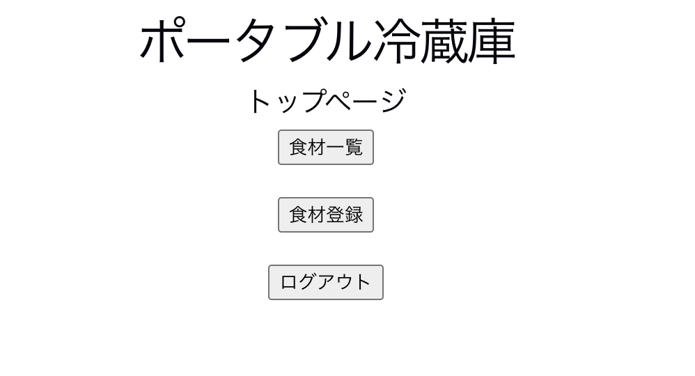
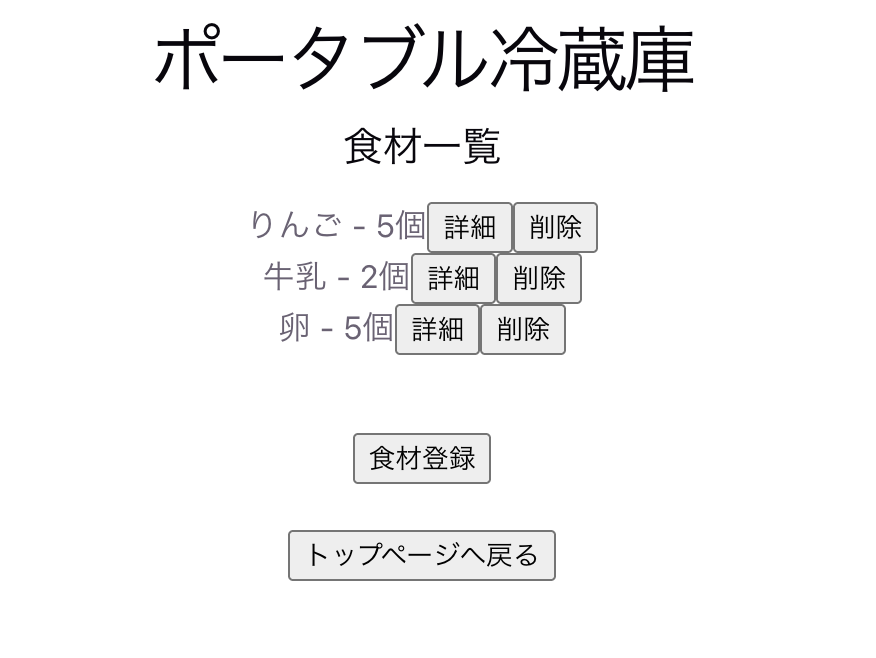
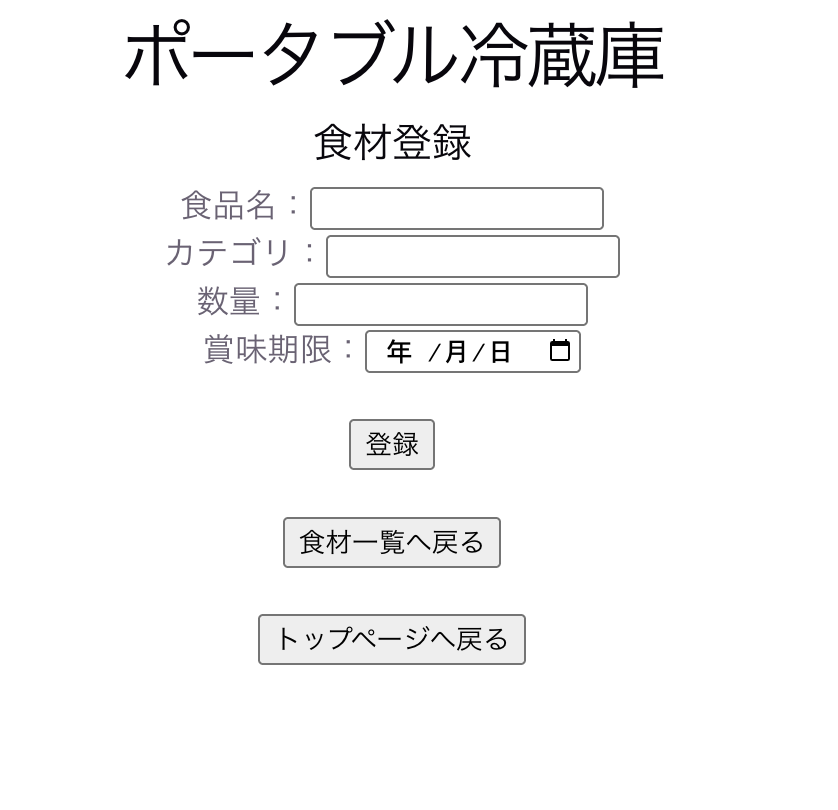
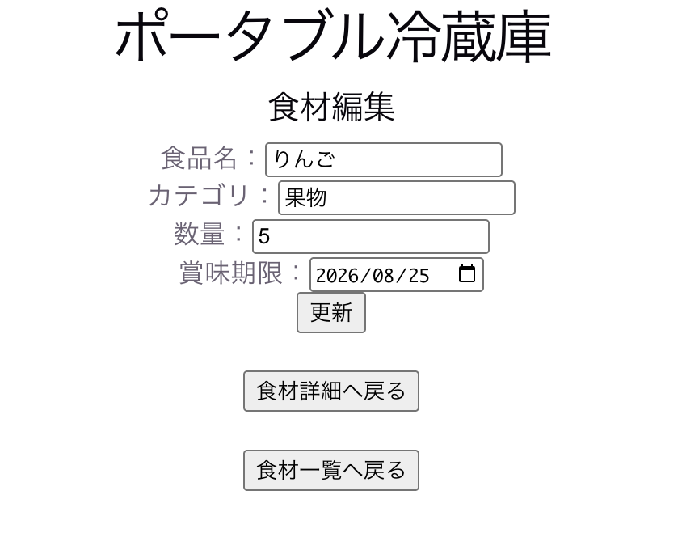
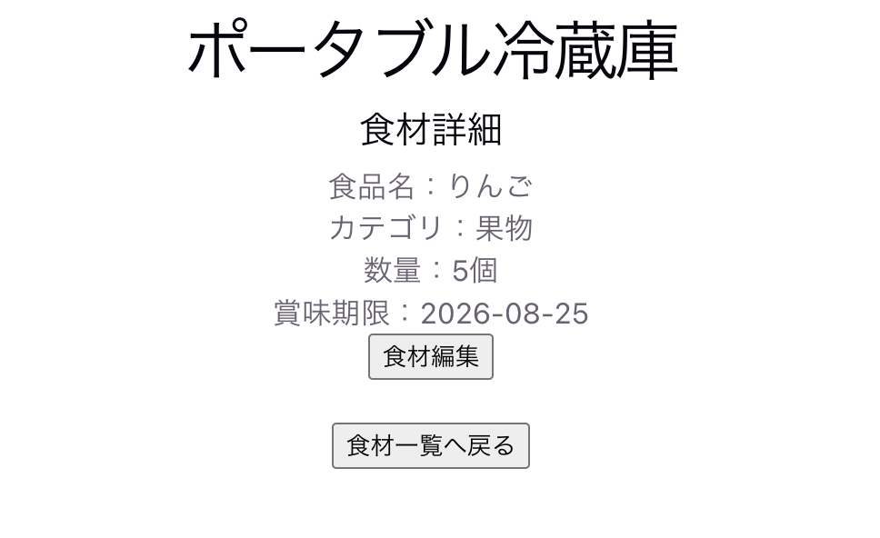
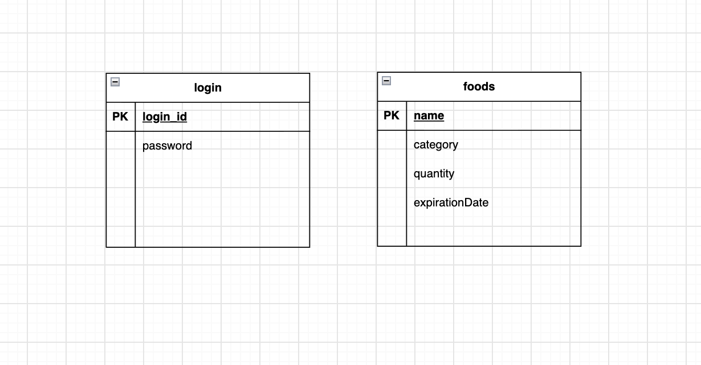

# 冷蔵庫食材管理Webアプリ

## 「冷蔵庫の中身を、かんたん・わかりやすく管理」

## アプリケーションの概要

冷蔵庫にある食材を登録・管理するWebアプリケーションです。

食材の名前、カテゴリー、数量、賞味期限を登録し、
一覧表示・詳細確認・編集・削除を行うことができます。

また、ログイン認証を実装しており、
ログインしていない状態では食材管理APIを利用できないようにしています。

## 画面・機能の説明

### ログイン画面

ログインIDとパスワードを入力してログインします。
認証に失敗した場合はエラーメッセージを表示します。

### トップ画面

ログイン後に表示される画面です。
食材一覧の確認や食材登録、ログアウトを行うことができます。

### 食材一覧画面

登録されている食材を一覧で確認できます。
食材の詳細確認、削除、新しい食材の登録を行うことができます。

### 食材登録画面

食材名、カテゴリー、数量、賞味期限を入力して、
新しい食材を登録できます。

### 食材編集画面

登録済みの食材のカテゴリー、数量、賞味期限を変更できます。

### 食材詳細画面

選択した食材のカテゴリー、数量、賞味期限などの詳細情報を確認できます。
編集画面への移動もできます。

## アプリケーションURL

GitHubリポジトリ：

https://github.com/a3tayuidmuv-spec/refrigerator-app

※現在はローカル環境で動作するアプリケーションです。

## 開発した背景

冷蔵庫にある食材を簡単に把握・管理できるようにしたいと考え、
冷蔵庫の食材管理アプリを開発しました。

また、Webアプリケーション開発を通して、
フロントエンドとバックエンドを分けた構成や、
APIを利用したデータの登録・取得・更新・削除、
ログイン認証などの実装を学ぶことを目的としています。

## 画面・機能の説明

### ログイン画面

ログインIDとパスワードを入力してログインします。

- ログイン認証
- ログイン失敗時のエラー表示
- ログイン状態の保持

### トップ画面

ログイン後に表示される画面です。

食材一覧画面への移動やログアウトを行うことができます。

### 食材一覧画面

登録されている食材を一覧で確認できます。

- 食材一覧表示
- 食材詳細画面への移動
- 食材の新規登録
- 食材の削除

### 食材詳細画面

選択した食材の詳細情報を確認できます。

### 食材登録画面

以下の情報を入力して新しい食材を登録できます。

- 食材名
- カテゴリー
- 数量
- 賞味期限

### 食材編集画面

登録済みの食材について、

- カテゴリー
- 数量
- 賞味期限

を編集できます。

### ログアウト

ログアウトするとログイン状態を解除し、
ログイン画面に戻ります。

### 認証機能

Spring Securityを使用してログイン認証を実装しています。

ログインしていない状態で食材APIへアクセスした場合は、
401 Unauthorizedを返すようにしています。

## 主な使用技術

### フロントエンド

- React
- JavaScript
- Vite

### バックエンド

- Java
- Spring Boot
- Spring Security
- Spring Data JPA

### データベース

- H2 Database

### 開発環境・ツール

- IntelliJ IDEA
- Git
- GitHub

## ER図

アプリケーションで使用しているデータベースのER図です。

